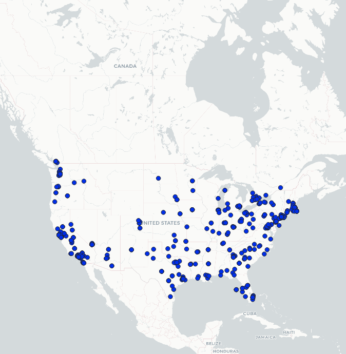
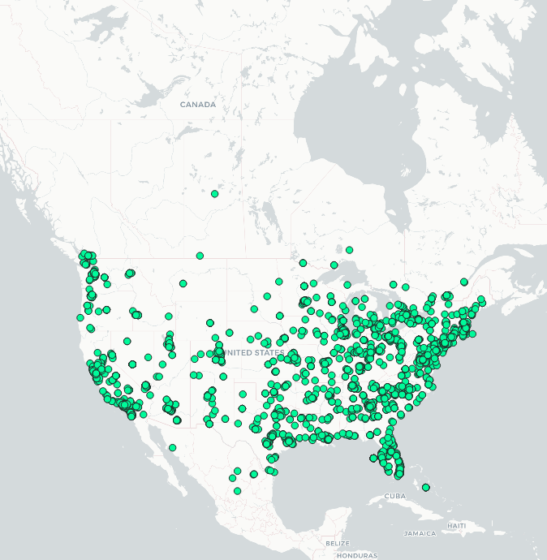
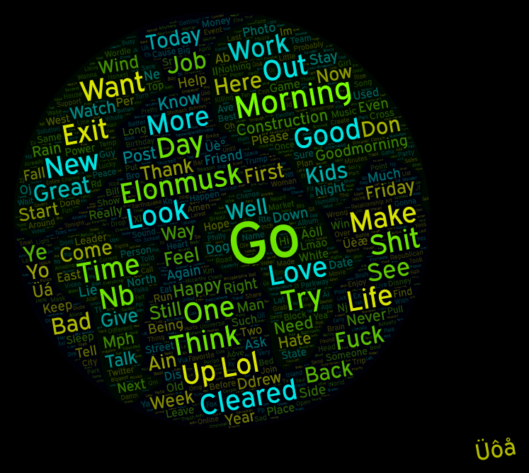

## Ali Basbeth
##### April 22, 2022
##### GEOG 458 Lab 2

**1.** For this project I have decided to acquire geo-tagged tweets in the contiguous United States. I downloaded the data from two different time windows. First, I downloaded the data during the afternoon, and the second data was downloaded after midnight around 2 am. The reason why I choose to do this comparison is because I am always fascinated by the amount of social media users in the United States, and twitter in particular. In addition, I am always fascinated by how massive the US is, and the dynamic of its population. Many unique and exciting events occur here in the states almost on a minute basis, and twitter is one platform that helps spread the events that are happening in the US through tweets, news and many more. 

**2.**
###### Figure 1: Map of Geotagged Tweets Morning(AM)

###### Figure 2: Map of Geotagged Tweets Noon(PM)

The two maps clearly represent differences between them. Firstly, the first map with the green symbology visualizes the data downloaded during the afternoon time. On this map, we can see that spatial distribution of tweets is much more active during this time. This might be that people started to operate, interact, and communicate through twitter during the afternoon time. The evidence is clear that almost all the geo-tagged tweets varied geographically in PM. For instance, the states such as Montana, and Idaho have much more tweets during the afternoon. Also, tweets are more prominent in PM across the major cities in the US, Los Angeles, NYC, Seattle, and Houston. On the other hand, the second map uses data that was downloaded during the early morning hours. As we can see that the spatial distribution of tweets is not uniformly distributed across the mainland US. Going back to Montana, and Idaho, there are almost no tweets coming from these two states during the AM. However, tweets still exist among large cities, including Las Vegas, NV. 

**3.** 
###### Figure 3: Words Cloud of Morning Tweets

###### Figure 4: Words Cloud of Noon to Evening Tweets

The first picture with the black background color represents tweets from the AM in a form of word cloud. In that visualization, we can clearly see a variety of words such as sleep, morning, construction, and happy. Some of these words indicate that the tweets are related to things that usually happen in the morning, and feelings of individuals. Although, there is a tweet like the word Elon Musk, it is due to the current viral topic in the social media regarding Mr.Musk trying to acquire twitter, and these tweets happen in the AM. In the second picture, it is a word cloud that is based on data acquired from the afternoon or PM. When you see the word cloud, you can see many different words that relate to the event and space where that event took place. These events include work, eating maybe during lunch or dinner, and also school, where many people usually still in school. I wanted to point out that the word day comes twice in both visualizations. I argue that it might be one of the most popular words in the contiguous US during Thursday afternoon to evening, and Friday morning. 